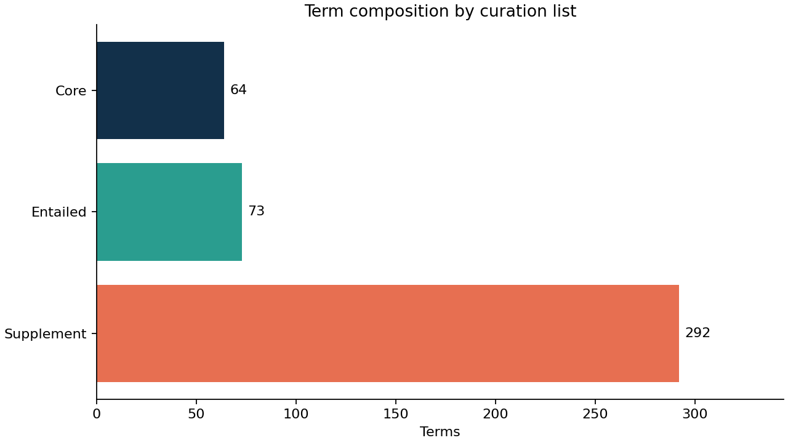
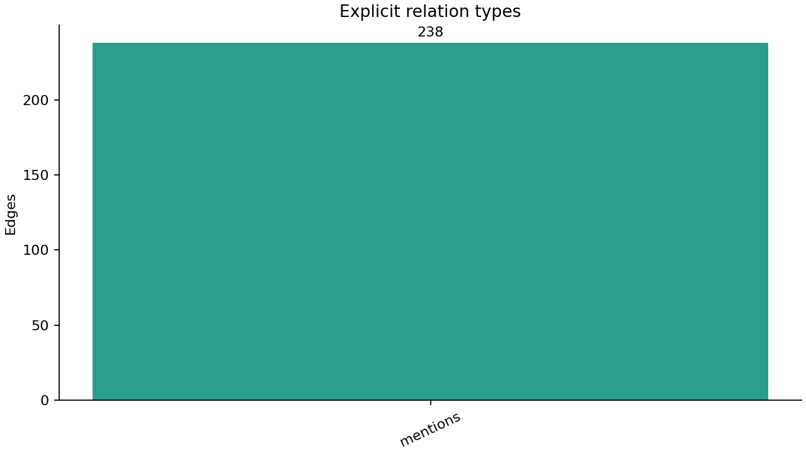
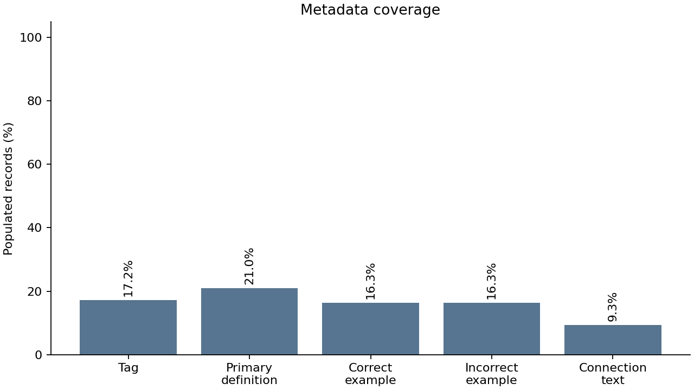
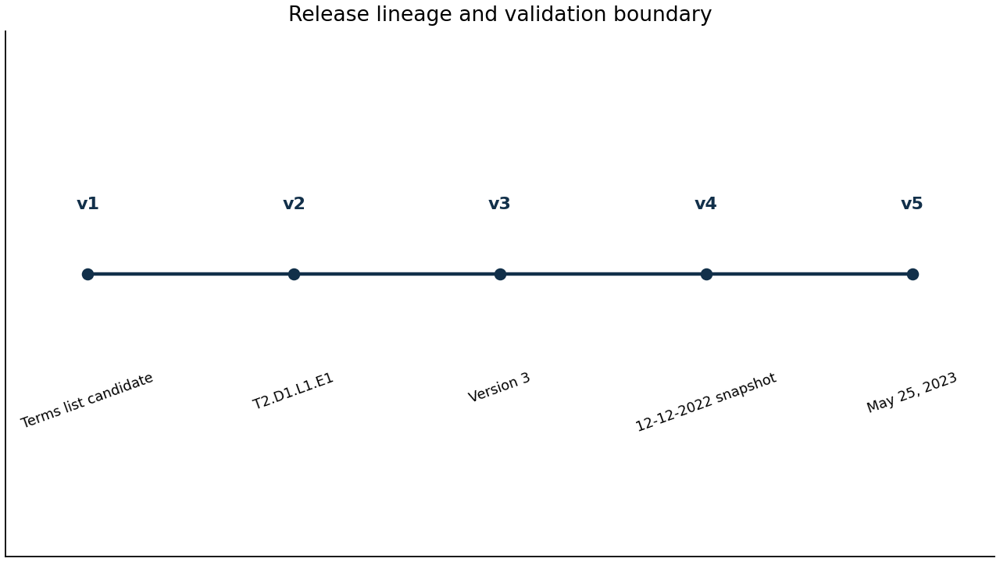
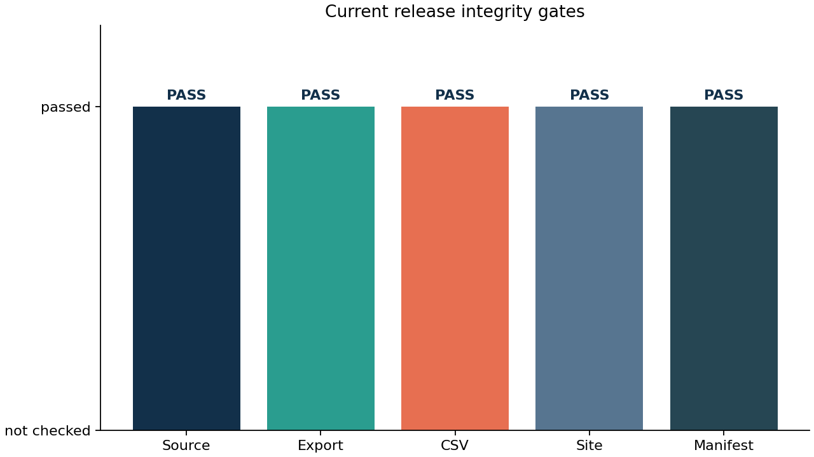

# Results {#sec:results}

## Release profile

The generated profile is shown in [@tbl:profile]. The source contains {{TERM_COUNT}} terms, distributed as {{LIST_COUNTS}}. All current terms have status `published`; the status field remains explicit so later releases can record draft, deprecated, merged, or retired records without changing the export shape.

{{TABLE_PROFILE}}

[@fig:composition] visualizes the list distribution. The largest list is Supplement, while Core and Entailed provide smaller curated subsets. The distribution is descriptive of this release and should not be interpreted as a ranking of scientific importance.

{#fig:composition width=82%}

## Graph structure

The graph contains {{RELATION_COUNT}} edges. [@tbl:relations] and [@fig:relations] show that every current edge has type `mentions`. This result is expected from the conservative migration rule: free-text connections are preserved as auditable references without automatic semantic strengthening.

{{TABLE_RELATIONS}}

{#fig:relations width=82%}

## Metadata coverage

The source preserves historical sparsity rather than fabricating values. [@tbl:completeness] reports populated and missing fields. Core terms satisfy the configured required metadata contract, while blank optional metadata in Entailed and Supplement records remains visible in the report. This distinction prevents structural completeness from being confused with content completeness.

{{TABLE_COMPLETENESS}}

{#fig:metadata width=88%}

## Release and artifact integrity

The manifest records the release lineage in [@tbl:releases] and current artifact paths and hashes in [@tbl:artifacts]. The historical sequence is retained as v1 through {{RELEASE_VERSION}}, with v5 as the current structured release. [@fig:release] shows the sequence; [@fig:validation] summarizes the current release gates.

{{TABLE_RELEASES}}

{{TABLE_ARTIFACTS}}

{#fig:release width=88%}

{#fig:validation width=88%}
