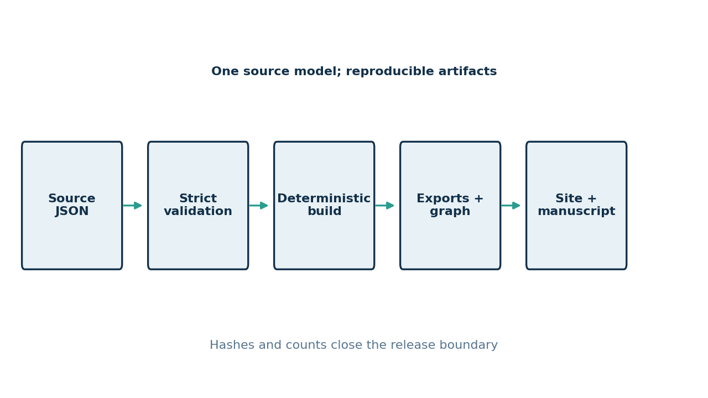

# Methods {#sec:methods}

## Source model

Let the ontology release be the tuple

$$
\mathcal{O} = (T, R, M, P)
$$ {#eq:ontology-model}

where $T$ is the finite set of term records, $R$ is the set of typed relation records, $M$ is release and schema metadata, and $P$ is the provenance and integrity record. A term record $t \in T$ contains an opaque identifier, a display label, aliases, status, list, nullable tag, structured definitions, structured examples, raw connection text, and outgoing relations. The source document at `ontology.source.json` is the only editable representation. The CSV, JSON export, browser, and manuscript are derived artifacts.

The identity rule is explicit:

$$
\operatorname{id}(t) = i_t, \qquad i_t \in \mathcal{I}, \qquad \operatorname{label}(t) \in \mathcal{L}
$$ {#eq:term-identity}

where the identifier set $\mathcal{I}$ is validated independently from the label set $\mathcal{L}$. A label rename therefore preserves identity when $i_t$ is unchanged. Labels and aliases are unique case-insensitively across the release. Initial migration identifiers were derived from labels only because no earlier stable identifier field existed; subsequent curation must retain the assigned identifier.

## Relation graph and migration

The graph exported to `ontology.json` is

$$
G = (V, E), \qquad V = \{i_t : t \in T\}, \qquad E \subseteq V \times \mathcal{R} \times V
$$ {#eq:typed-graph}

where $\mathcal{R}$ is the configured relation vocabulary. The current release uses only `mentions` edges. During migration, a connection string is searched for exact case-insensitive occurrences of other display labels; each occurrence produces one explicit `mentions` edge after duplicate suppression. No stronger relation is inferred from the text. Self-relations, unknown targets, duplicate edges, invalid identifiers, and unsupported relation types fail validation.

{#fig:pipeline width=92%}

## Deterministic generation and validation

The generator is a pure transformation of the configured source and release metadata:

$$
\operatorname{artifact}_k = F_k(\mathcal{O}, C), \qquad H_k = \operatorname{SHA256}(\operatorname{bytes}(\operatorname{artifact}_k))
$$ {#eq:deterministic-generation}

where $C$ is `ontology.toml`, $F_k$ is the generator for artifact $k$, and $H_k$ is recorded in the release manifest. JSON keys and graph edges are sorted, CSV rows follow source order, and figures use fixed data, styles, dimensions, and metadata. Atomic writes prevent partially written text artifacts from becoming release state.

Validation is expressed as a conjunction of configured predicates:

$$
\operatorname{Valid}(\mathcal{O}, C) = \bigwedge_{p \in \Pi_C} p(\mathcal{O}, C)
$$ {#eq:validation-predicate}

The predicate set includes JSON shape, required fields, enumerations, identifier and target validity, cross-record uniqueness, source/export equality, CSV and site freshness, manifest paths and hashes, numeric release order, and strict JSON Schema validation with the pinned `jsonschema` dependency [@jsonschema2020]. Core terms require tags, primary definitions, and correct examples; permitted gaps remain reportable for Entailed and Supplement terms.

## Release integrity

For every listed artifact, the manifest must close the path and hash relation:

$$
\operatorname{ManifestOK}(a) \Longleftrightarrow \operatorname{exists}(a.path) \land \operatorname{SHA256}(a.path) = a.sha256
$$ {#eq:manifest-integrity}

The current release includes the source, CSV, JSON export, site, three schemas, and validation summary. Historical releases remain immutable archive evidence; their metadata is explicitly marked as not evaluated where the current v2 contract cannot be retroactively established.
